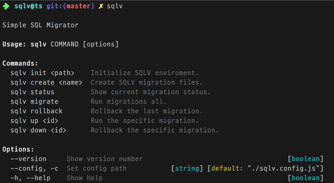

# SQLV

[](https://travis-ci.org/corgidisco/sqlv)
[](https://npmcharts.com/compare/sqlv?minimal=true)
[](https://www.npmjs.com/package/sqlv)
[](https://www.npmjs.com/package/sqlv)

[](https://www.npmjs.com/package/sqlv)

Let SQL do what SQL can.

SQLV is very simple SQL Migrator.



## Installation

```bash
npm install sqlv -g # or npm install sqlv --dev
```

## Usage

Initialize.

```bash
sqlv init .
```

This will create a configuration file, `sqlv.config.js`.

You need to install additional packages(`mysql`, `mysql2`, `pg`, `sqlite3`) to match your database. SQLV is
based on the [async-db-adapter](https://www.npmjs.com/package/async-db-adapter).

example,

```bash
npm install mysql2 -g
```

Now, edit `sqlv.config.js` file as follows:

```js
module.exports = {
  adapter: "mysql2",
  host: "localhost",
  database: "",
  user: "sqlvuser",
  password: "********",
}
```

### Create Migrations

```bash
sqlv create create_init_tables
```

Two files(`create_init_tables.up.sql`, `create_init_tables.down.sql`) are created under
the `./migrations` directory.

Now, Migrate!

```bash
sqlv migrate
```

Done! :-)

## Commands

- `init <path>` : Initialize the project.
- `create <name>` : Create a migration file.
- `status` : Show migration status.
- `migrate` : Migrate.
- `rollback` : Rollback.
- `up <migration_id>` : Only apply the specific migration.
- `down <migration_id>` : Only rollback the specific migration.

## How to use

### Multi-Connection

If you have multiple DB connections, you can use:

```js
// sqlv.config.js
module.exports = {
  connections: {
    default: {
      adapter: "mysql",
      host: "localhost",
      database: "test",
      user: "root",
      password: "",
    },
    pg: {
      adapter: "pg",
      user: "root",
      password: "",     
    },
  },
}
```

Migrations files, you can specify a connection with a comment.

```sql
-- @sqlv connection: pg

CREATE /* ...SQL Syntax.... */;
```

You can specify multiple connections for one file.

```sql
-- @sqlv connection: default

CREATE /* ...SQL Syntax.... */;
CREATE /* ...SQL Syntax.... */;
CREATE /* ...SQL Syntax.... */;

-- @sqlv connection: pg

CREATE /* ...SQL Syntax.... */;
CREATE /* ...SQL Syntax.... */;
```


## License

MIT
